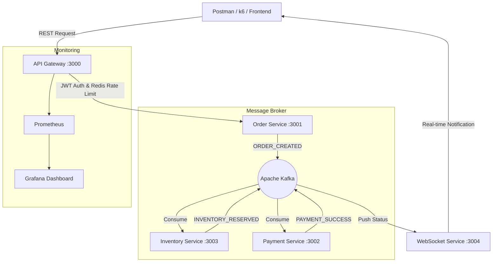

-----

# 🚀 Event-Flux

### High-Performance Event-Driven Microservices Architecture

[](https://www.google.com/search?q=https://github.com/abhilashg1/event-flux/actions)

**Event-Flux** is a distributed, event-driven system designed to handle high-concurrency order processing. It demonstrates the **Choreographed Saga Pattern** to maintain data consistency across multiple microservices without a central orchestrator.

Built as a **Senior-level Backend Engineering** demonstration, the system handles complex failure states, distributed rate limiting, and real-time observability.

-----

## 🏗 System Architecture



-----

## 🚀 Key Features

  * **Choreographed Saga Pattern:** Manages distributed transactions across Order, Inventory, and Payment services using Kafka events.
  * **High Throughput:** Optimized to handle **400+ Requests Per Second (RPS)**. Successfully processed **21,900+ orders** in a 50-second stress test.
  * **Observability & Metrics:** Integrated **Prometheus** scraping and **Grafana** visualization for real-time system health monitoring.
  * **Security & Resilience:** \* **JWT Authentication** for all protected routes.
      * **Redis-backed Distributed Rate Limiting** to prevent service denial.
      * **Helmet.js & CORS** protection at the Gateway level.
  * **Typed Monorepo:** Managed by **Turborepo** with shared packages for Kafka clients, structured logging (Pino), and TypeScript types.

-----

## 🛠 Tech Stack

| Layer | Technology |
| :--- | :--- |
| **Runtime** | Node.js (v22+) |
| **Language** | TypeScript (Strict Mode, NodeNext Resolution) |
| **Orchestration** | Apache Kafka (KafkaJS) |
| **Monorepo** | Turborepo |
| **Database** | PostgreSQL (Prisma ORM) |
| **Caching/Security** | Redis (ioredis) |
| **Observability** | Prometheus & Grafana |
| **Logging** | Pino Structured Logging |

-----

## 🚦 Installation & Setup

### 1\. Infrastructure

Ensure Docker is running, then spin up the required containers:

```bash
cd infra/docker
docker-compose up -d
```

### 2\. Dependencies & Build

From the project root:

```bash
npm install
npx turbo build
```

### 3\. Database Initialization

Push the Prisma schemas to your local PostgreSQL instance:

```bash
npx turbo run db:push
```

### 4\. Development Mode

Run all services simultaneously with live-reloading:

```bash
npx turbo dev
```

-----

## 📈 Performance Testing

The system includes a pre-configured **k6** load testing script to validate scalability.

**Results from the latest Stress Test:**

  * **Total Requests:** 21,938
  * **Avg Duration:** 25.16ms
  * **Throughput:** \~430 requests/sec
  * **Max Concurrent VUs:** 1,000

To run the test:

```bash
# Ensure your API Gateway is running
k6 run load-test.ts
```

-----

## 🧪 Observability Endpoints

  * **API Gateway:** [http://localhost:3000](https://www.google.com/search?q=http://localhost:3000)
  * **Metrics (Prometheus format):** [http://localhost:3000/metrics](https://www.google.com/search?q=http://localhost:3000/metrics)
  * **Prometheus UI:** [http://localhost:9090](https://www.google.com/search?q=http://localhost:9090)
  * **Grafana Dashboard:** [http://localhost:3005](https://www.google.com/search?q=http://localhost:3005) (User: `admin` | Pass: `admin`)
  * **Swagger Docs:** [http://localhost:3000/docs](https://www.google.com/search?q=http://localhost:3000/docs)

-----

## 👤 Author

**Abhilash Gandhamalla**

  * **Docker Hub:** [abhilashg1](https://www.google.com/search?q=https://hub.docker.com/u/abhilashg1)
  * **Focus:** Full Stack Engineering | Distributed Systems 

-----

*This project is a technical implementation of a scalable, production-ready microservices architecture.*